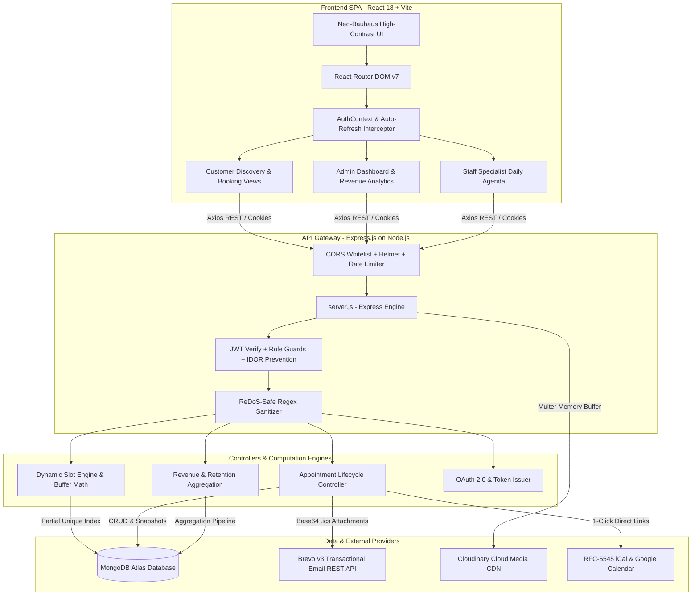
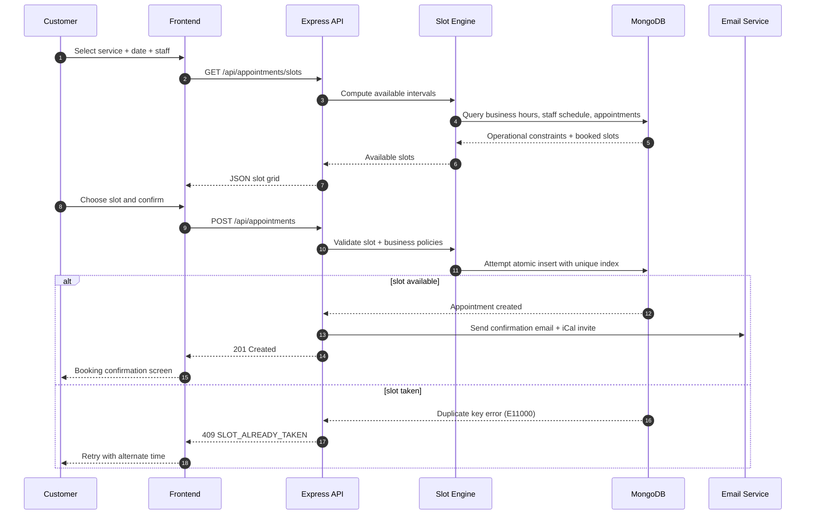
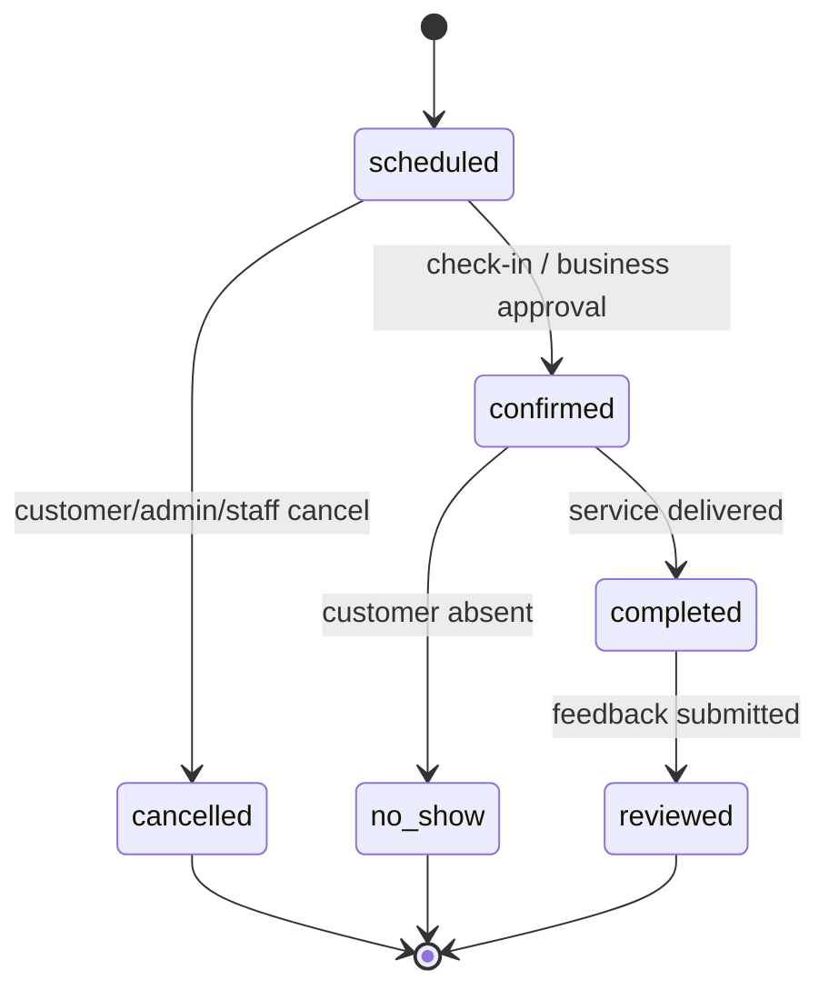
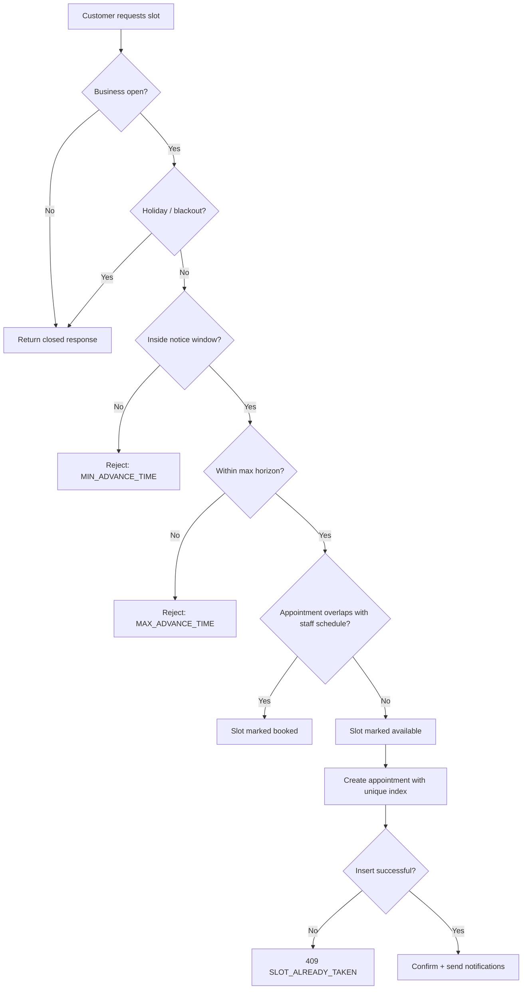

# ⚡ Slotify — Comprehensive Technical & Architectural Documentation

> **Slotify** is an enterprise-grade, multi-tenant appointment booking and real-time scheduling platform engineered with the **MERN** stack (MongoDB, Express.js, React, Node.js) and a **Neo-Bauhaus high-contrast aesthetic**. It features hardware-enforced concurrency locks to guarantee zero double bookings, immutable snapshot pricing in ₹ INR, 2-way Google and Apple calendar synchronization via RFC-5545 iCalendar feeds, automated transactional email lifecycles powered by Brevo, and verified customer review scorecards.
>
> **Project Group**: `CSE_182` — Final Year Major Capstone Project, Department of Computer Science & Engineering, Faculty of Engineering & Technology (PIET), **Parul University**, Vadodara, Gujarat, India.

---

## 📑 Table of Contents

1. [Executive Summary & Platform Capabilities](#1-executive-summary--platform-capabilities)
2. [End-to-End System Architecture](#2-end-to-end-system-architecture)
3. [Technology Stack Matrix](#3-technology-stack-matrix)
4. [Database Schema & Data Model Deep Dive](#4-database-schema--data-model-deep-dive)
5. [How the Database Works with the Backend](#5-how-the-database-works-with-the-backend)
6. [Dynamic Slot Engine & Concurrency Control](#6-dynamic-slot-engine--concurrency-control)
7. [Email Engine, iCalendar & Notification Systems](#7-email-engine-icalendar--notification-systems)
8. [Backend File-by-File Technical Breakdown](#8-backend-file-by-file-technical-breakdown)
9. [Frontend Architecture & State Management](#9-frontend-architecture--state-management)
10. [Frontend File-by-File Technical Breakdown](#10-frontend-file-by-file-technical-breakdown)
11. [End-to-End User Journeys & Workflows](#11-end-to-end-user-journeys--workflows)
12. [Complete REST API Specification](#12-complete-rest-api-specification)
13. [Security, Performance & Error Handling Matrix](#13-security-performance--error-handling-matrix)
14. [Local Setup, Environment Variables & Deployment](#14-local-setup-environment-variables--deployment)
15. [Academic Citation & Institutional Affiliations](#15-academic-citation--institutional-affiliations)

---

## 1. Executive Summary & Platform Capabilities

Appointment scheduling across modern service businesses (salons, clinics, consulting firms, fitness studios) suffers from severe architectural flaws:

1. **Race Conditions & Double Bookings**: When multiple users book the same specialist at the same time, naive database queries fail to prevent overlaps.
2. **Retroactive Price Creep**: Altering a service price alters historical revenue and past booking receipts retroactively if pricing is not snapshot-isolated.
3. **Calendar Isolation**: Lack of 2-way calendar sync causes forgotten appointments, customer no-shows, and fragmented schedules.
4. **Unverified Reviews & Spam**: Platforms allow anyone to post reviews, distorting business credibility.

**Slotify** resolves all four challenges through:

- **Hardware-Enforced Atomic Concurrency Locks**: Leveraging MongoDB compound partial unique indexing to make double-booking physically impossible at the database engine level.
- **Immutable Snapshot Pricing**: Every booking permanently freezes `priceAtBooking` (₹ INR) and `durationAtBooking`, preserving audit integrity regardless of future rate card edits.
- **2-Way Calendar Synchronization**: Live RFC-5545 iCalendar (`.ics`) generation for Apple/Outlook calendars and instant 1-click Google Calendar integration.
- **Brevo Transactional Automation**: Multi-role HTML email pipelines for confirmation, 24-hour reminders, 2-hour reminders, cancellation, rescheduling, and post-session review invitations.
- **Verified Customer Scorecards**: Only customers who completed a verified appointment can submit 1–5 star reviews and feedback for both the business and individual specialists.
- **Multi-Tenant Architecture with Walk-In Mode**: Isolated portals for Customers, Business Owners (Admins), and Staff Specialists, complemented by a rapid Walk-In (POS) interface for reception desks.

---

## 2. End-to-End System Architecture



### Booking Lifecycle Sequence Diagram



### Appointment State Machine



---

## 3. Technology Stack Matrix

### Frontend Layer

| Technology           | Package Version | Architectural Purpose                                                                                  |
| -------------------- | --------------- | ------------------------------------------------------------------------------------------------------ |
| **React**            | `^18.2.0`       | Core UI library providing virtual DOM reconciliation, hooks, and context.                              |
| **Vite**             | `^7.3.0`        | Next-generation frontend build tooling with near-instant hot module replacement (HMR).                 |
| **Tailwind CSS**     | `^3.4.0`        | Utility-first CSS engine implementing the bespoke Neo-Bauhaus high-contrast design system.             |
| **React Router DOM** | `^7.18.2`       | Declarative client-side routing, protected route wrappers, and dynamic query param parsing.            |
| **Axios**            | `^1.19.0`       | Promise-based HTTP client equipped with request authorization and response token-refresh interceptors. |
| **Lucide React**     | `^0.298.0`      | Comprehensive, consistent vector icon library.                                                         |
| **date-fns**         | `^3.0.6`        | Lightweight, immutable date arithmetic, timezone formatting, and calendar math.                        |
| **Lenis**            | `^1.3.26`       | Physics-driven smooth inertial scrolling engine.                                                       |
| **React Hot Toast**  | `^2.4.1`        | Non-blocking, accessible toast alerts customized with Neo-Bauhaus borders.                             |
| **React Hook Form**  | `^7.49.2`       | High-performance form state management with minimal re-renders.                                        |

### Backend Layer

| Technology                  | Package Version | Architectural Purpose                                                                      |
| --------------------------- | --------------- | ------------------------------------------------------------------------------------------ |
| **Node.js**                 | `>=18.0.0`      | Scalable JavaScript runtime environment running on V8.                                     |
| **Express.js**              | `^4.18.2`       | Minimalist web application framework for routing, middleware pipelines, and API endpoints. |
| **Mongoose**                | `^8.0.3`        | Object Data Modeling (ODM) layer managing schemas, compound indexes, and hooks.            |
| **Passport.js**             | `^0.7.0`        | Authentication middleware orchestrating OAuth 2.0 social login.                            |
| **passport-google-oauth20** | `^2.0.0`        | Strategy for authenticating with Google via OAuth 2.0.                                     |
| **jsonwebtoken (JWT)**      | `^9.0.2`        | Signed bearer access tokens (short-lived) and refresh tokens (long-lived).                 |
| **bcryptjs**                | `^2.4.3`        | Salted 10-round one-way password hashing.                                                  |
| **node-cron**               | `^4.6.0`        | Background task runner executing hourly reminder schedules.                                |
| **@getbrevo/brevo**         | `^6.0.3`        | Direct REST API client for transactional HTML emails and iCal attachments.                 |
| **cloudinary**              | `^2.8.0`        | Cloud-based media storage and image optimization CDN for business logos and banners.       |
| **multer**                  | `^1.4.5-lts.1`  | In-memory multipart/form-data handler for file uploads.                                    |
| **cookie-parser**           | `^1.4.6`        | HTTP cookie serialization and parsing for secure refresh token handling.                   |
| **cors**                    | `^2.8.5`        | Cross-Origin Resource Sharing control with dynamic origin matching.                        |
| **dotenv**                  | `^16.3.1`       | Environment variable injector.                                                             |

---

## 4. Database Schema & Data Model Deep Dive

The database architecture is designed with strict multi-tenancy. Every business entity maintains independent data while sharing a unified MongoDB Atlas cloud database.

```
┌────────────────────────────────────────────────────────────────────────┐
│                              USER SCHEMA                               │
├──────────────────────────┬──────────────────────────┬──────────────────┤
│ Field Name               │ Data Type                │ Constraints      │
├──────────────────────────┼──────────────────────────┼──────────────────┤
│ _id                      │ ObjectId                 │ Primary Key      │
│ name                     │ String                   │ Required, Trim   │
│ email                    │ String                   │ Required, Unique │
│ password                 │ String                   │ Hash, Select: 0  │
│ role                     │ Enum: customer, admin,   │ Default: customer│
│                          │       staff              │                  │
│ businessId               │ ObjectId -> Business     │ Ref, Nullable    │
│ emailVerified            │ Boolean                  │ Default: false   │
│ googleId                 │ String                   │ Sparse, Unique   │
│ authProvider             │ Enum: local, google      │ Default: local   │
│ notificationPreferences  │ Embedded Object          │ Email/App Flags  │
│ googleCalendarSync       │ Embedded Object          │ AutoSync Flags   │
└──────────────────────────┴──────────────────────────┴──────────────────┘
            ▲                           ▲                     ▲
            │ (adminId)                 │ (userId)            │ (customerId)
            │                           │                     │
┌───────────┴──────────────┐ ┌──────────┴───────────┐ ┌───────┴──────────┐
│     BUSINESS SCHEMA      │ │     STAFF SCHEMA     │ │APPOINTMENT SCHEMA│
├──────────────────────────┤ ├──────────────────────┤ ├──────────────────┤
│ _id: ObjectId            │ │ _id: ObjectId        │ │ _id: ObjectId    │
│ name: String             │ │ businessId: ObjectId │ │ businessId: Ref  │
│ slug: String (Unique)    │ │ userId: ObjectId     │ │ customerId: Ref  │
│ category: String         │ │ name: String         │ │ serviceId: Ref   │
│ adminId: Ref -> User     │ │ specialization: Str  │ │ staffId: Ref     │
│ address: Object          │ │ workingHours: Object │ │ priceAtBooking: ₹│
│ workingHours: Object     │ │ unavailableDates: Arr│ │ durationAtBooking│
│ bookingSettings: Object  │ │ serviceIds: [Ref]    │ │ startTime / endTime
│ stats: Object            │ │ isActive: Boolean    │ │ blockedUntil: Date
└───────────┬──────────────┘ └──────────┬───────────┘ │ status: Enum     │
            │                           │             │ actionLog: Array │
            ▼                           ▼             └────────┬─────────┘
┌──────────────────────────┐            │                      │
│      SERVICE SCHEMA      │            │                      ▼
├──────────────────────────┤            │             ┌──────────────────┐
│ _id: ObjectId            │            │             │  REVIEW SCHEMA   │
│ businessId: Ref          │            │             ├──────────────────┤
│ name: String             │            │             │ _id: ObjectId    │
│ duration: Number (mins)  │            │             │ appointmentId:   │
│ price: Number (₹ INR)    │            │             │   Unique Ref     │
│ bufferTime: Number (mins)│            │             │ businessId: Ref  │
│ staffIds: [Ref -> User]  │            │             │ customerId: Ref  │
│ isActive: Boolean        │            │             │ staffId: Ref     │
└──────────────────────────┘            │             │ rating: 1 - 5    │
                                        │             │ comment: String  │
                                        │             └──────────────────┘
```

### Detailed Schema Specifications

#### 1. User Model (`backend/models/User.js`)

- **`name`** (`String`, required, trimmed): Full legal/display name.
- **`email`** (`String`, required, unique, lowercase, regex-validated): Primary identity credential.
- **`password`** (`String`, minlength 8, `select: false`): Bcrypt salted hash. Excluded from query results by default to avoid accidental exposure.
- **`phone`**, **`countryCode`** (`String`, optional): Contact coordinates.
- **`role`** (`String`, enum `['customer', 'admin', 'staff']`, default: `'customer'`): Role-based access control selector.
- **`profilePicture`** (`String`): CDN URL of user avatar.
- **`businessId`** (`ObjectId`, ref: `'Business'`, default: `null`): Established if the user owns or works for a tenant.
- **`emailVerified`** (`Boolean`, default: `false`): Verification state.
- **`emailVerificationToken`**, **`emailVerificationExpires`**: Hashed token and expiry date for email activation.
- **`googleId`** (`String`, sparse unique index): OAuth identifier.
- **`authProvider`** (`String`, enum `['local', 'google']`, default: `'local'`): Provider origin.
- **`resetPasswordToken`**, **`resetPasswordExpires`**: Self-service recovery fields.
- **`notificationPreferences`**:
  - `emailBookingConfirmation`: Boolean (default: `true`)
  - `email24hReminder`: Boolean (default: `true`)
  - `email2hReminder`: Boolean (default: `true`)
  - `emailCancellation`: Boolean (default: `true`)
  - `inAppRealtime`: Boolean (default: `true`)
  - `inAppReminders`: Boolean (default: `true`)
- **`googleCalendarSync`**:
  - `autoSync`: Boolean (default: `true`)
  - `sendInvites`: Boolean (default: `true`)
  - `autoRemove`: Boolean (default: `true`)
- **Indexes**: Compound index on `{ businessId: 1, role: 1 }`.

#### 2. Business Model (`backend/models/Business.js`)

- **`name`** (`String`, required): Registered trading entity name.
- **`slug`** (`String`, unique, lowercase): Clean URL slug automatically generated via a pre-save regex hook (`name.toLowerCase().replace(/[^a-z0-9]+/g, "-")`).
- **`tagline`** (`String`, max 100 chars), **`description`** (`String`, max 2000 chars).
- **`category`** (`String`, required): Industry vertical (`"Salon"`, `"Healthcare"`, `"Fitness"`, `"Spa"`, `"Consulting"`).
- **`adminId`** (`ObjectId`, ref: `'User'`, required): Owner account ID.
- **`contactEmail`**, **`contactPhone`**, **`website`**: Tenant communication channels.
- **`address`**:
  - `street`, `city`, `state`, `country`, `postalCode`, `fullAddress`, `landmark`, `instructions`.
- **`logo`**, **`coverPhoto`**, **`photos`**: Cloudinary URLs with captions and primary flags.
- **`verification`**:
  - `status`: Enum `['unverified', 'pending', 'verified']` (default: `'unverified'`).
  - `document`: `{ type: enum ['aadhaar', 'pan'], fileUrl, fileFormat, uploadedAt }`.
- **`workingHours`**: Weekly operational schedule using `workingHoursSchema` for all 7 days (`monday` through `sunday`), each containing:
  - `isOpen`: Boolean.
  - `slots`: Array of `{ start: "HH:MM", end: "HH:MM" }`.
  - `breaks`: Array of `{ start: "HH:MM", end: "HH:MM" }` (e.g., lunch breaks).
- **`holidays`**: Array of `{ date: Date, reason: String, isRecurring: Boolean }`.
- **`bookingSettings`**:
  - `minAdvanceTime`: Hours required before booking (default: 1 hour).
  - `maxAdvanceTime`: Maximum booking horizon (default: 90 days).
  - `cancellationWindow`: Notice required to cancel (default: 24 hours).
  - `rescheduleWindow`: Notice required to reschedule (default: 1 hour).
  - `maxReschedulesPerAppointment`: Maximum allowed adjustments (default: 2).
  - `requiresCustomerApproval`: Manual approval toggle (default: `false`).
  - `allowWalkIns`: POS receptionist mode toggle (default: `true`).
  - `cancellationFee`: Penalty fee in ₹ INR (default: 0).
- **`stats`**: Denormalized cached statistics:
  - `totalAppointments`, `totalCustomers`, `averageRating`, `totalReviews`.
- **Indexes**: `{ adminId: 1 }`, `{ category: 1 }`, `{ isActive: 1 }`, `{ slug: 1 }`.

#### 3. Service Model (`backend/models/Service.js`)

- **`businessId`** (`ObjectId`, ref: `'Business'`, required, indexed).
- **`name`** (`String`, required): Service title (e.g., "Deep Tissue Massage", "Dental Checkup").
- **`description`** (`String`, max 500 chars).
- **`category`** (`String`): Service category grouping.
- **`duration`** (`Number`, required): Session duration in minutes (5 to 480 mins).
- **`price`** (`Number`, required): Fee in ₹ INR (min: 0).
- **`bufferTime`** (`Number`, default: 0): Post-service sanitation and rest buffer (0 to 60 mins).
- **`staffIds`** (`[ObjectId]`, ref: `'User'`): Eligible providers.
- **`isActive`** (`Boolean`, default: `true`, indexed): Soft-delete flag.
- **Indexes**: Compound `{ businessId: 1, isActive: 1 }` and `{ businessId: 1, category: 1 }`.

#### 4. Staff Model (`backend/models/Staff.js`)

- **`name`** (`String`, required), **`email`** (`String`), **`phone`** (`String`).
- **`businessId`** (`ObjectId`, ref: `'Business'`, required, indexed).
- **`userId`** (`ObjectId`, ref: `'User'`, default: `null`): Optional login link for staff portal access.
- **`specialization`** (`String`): Professional title (e.g., "Senior Colorist", "Cardiologist").
- **`workingHours`**: Shift timings overriding the business's general hours.
- **`serviceIds`** (`[ObjectId]`, ref: `'Service'`): Specific catalog services assigned to this staff member.
- **`unavailableDates`** (`[{ date: Date, reason: String }]`): Approved leave / vacation blackout dates.
- **`isActive`** (`Boolean`, default: `true`, indexed).
- **Indexes**: Compound `{ businessId: 1, isActive: 1 }` and `{ userId: 1, businessId: 1 }`.

#### 5. Appointment Model (`backend/models/Appointment.js`)

- **`businessId`** (`ObjectId`, ref: `'Business'`, required, indexed).
- **`customerId`** (`ObjectId`, ref: `'User'`, indexed, nullable for walk-ins).
- **`serviceId`** (`ObjectId`, ref: `'Service'`, required).
- **`staffId`** (`ObjectId`, ref: `'Staff'`, indexed, nullable if unassigned).
- **`priceAtBooking`** (`Number`, required): Immutable snapshot price in ₹ INR.
- **`durationAtBooking`** (`Number`, required): Immutable snapshot duration in minutes.
- **`appointmentDate`** (`Date`, required, indexed): Face-value date normalized to local midnight.
- **`startTime`** (`String`, required, format `HH:MM`): Session commencement.
- **`endTime`** (`String`, required, format `HH:MM`): Session conclusion (`startTime` + `durationAtBooking`).
- **`blockedUntil`** (`Date`, indexed): Buffer-inclusive timestamp (`endTime` + `bufferTime`).
- **`status`** (`String`, enum: `['scheduled', 'confirmed', 'completed', 'cancelled', 'no-show']`, default: `'scheduled'`).
- **`isWalkIn`** (`Boolean`, default: `false`): Flag for front-desk entries.
- **`walkInNotes`** (`String`): Customer name and phone for unregistered clients.
- **`isRescheduled`**, **`rescheduledFrom`**, **`rescheduledTo`**, **`rescheduleCount`**, **`rescheduledAt`**, **`rescheduledBy`**.
- **`cancellationReason`**, **`cancelledAt`**, **`cancelledBy`** (`['customer', 'admin', 'staff', 'system']`).
- **`completedAt`**, **`completedBy`**.
- **`reminderSent`**: `{ day: Boolean, hours: Boolean }`.
- **`actionLog`**: Array of audit records:
  - `{ action: enum, performedBy: enum, performedAt: Date, reason: String, metadata: Mixed }`.
- **Crucial Unique Concurrency Index**:
  ```javascript
  appointmentSchema.index(
    { businessId: 1, staffId: 1, appointmentDate: 1, startTime: 1 },
    {
      unique: true,
      partialFilterExpression: {
        status: { $in: ["scheduled"] },
      },
    },
  );
  ```

#### 6. Review Model (`backend/models/Review.js`)

- **`appointmentId`** (`ObjectId`, ref: `'Appointment'`, required, unique, indexed): Ensures strictly one review per appointment.
- **`businessId`** (`ObjectId`, ref: `'Business'`, required, indexed).
- **`customerId`** (`ObjectId`, ref: `'User'`, required, indexed).
- **`staffId`** (`ObjectId`, ref: `'Staff'`, indexed).
- **`serviceId`** (`ObjectId`, ref: `'Service'`, required).
- **`rating`** (`Number`, required, min: 1, max: 5).
- **`comment`** (`String`, max 1000 chars, trimmed).
- **`staffRating`** (`Number`, min: 1, max: 5).

#### 7. Notification Model (`backend/models/Notification.js`)

- **`userId`** (`ObjectId`, ref: `'User'`, required, indexed).
- **`type`** (`String`, enum: `['appointment_confirmed', 'appointment_reminder', 'appointment_cancelled', 'appointment_rescheduled', 'appointment_completed', 'staff_invitation', 'business_verified']`).
- **`title`** (`String`, required), **`message`** (`String`, required).
- **`isRead`** (`Boolean`, default: `false`, indexed).
- **`appointmentId`** (`ObjectId`, ref: `'Appointment'`).
- **Indexes**: Compound `{ userId: 1, isRead: 1 }` and `{ userId: 1, createdAt: -1 }`.

---

## 5. How the Database Works with the Backend

The interaction between the Express backend and MongoDB Atlas is architected around **safe connection pooling**, **atomic writes**, **defense against race conditions**, and **immutable historical records**.

### 1. Connection Pooling & Event Lifecycle

In [`backend/config/database.js`](file:///c:/Users/Aksh/Documents/GitHub/Slotify/backend/config/database.js), Mongoose initializes a managed TCP connection pool:

- `maxPoolSize: 10`: Limits concurrent sockets to avoid exhausting MongoDB Atlas M0/M10 thread thresholds.
- `serverSelectionTimeoutMS: 5000`: Fails quickly during network partitioning.
- `socketTimeoutMS: 45000`: Prevents hanging sockets from blocking Express worker threads.
- Event listeners monitor `error`, `disconnected`, and `reconnected` events, logging structured diagnostic telemetry.

### 2. The Concurrency Problem & The Hardware-Enforced Solution

In conventional web apps, booking an appointment involves:

```
1. Client A queries: isSlotFree(10:00 AM)? -> Returns TRUE
2. Client B queries: isSlotFree(10:00 AM)? -> Returns TRUE
3. Client A writes: createAppointment(10:00 AM) -> SUCCESS
4. Client B writes: createAppointment(10:00 AM) -> SUCCESS (DOUBLE BOOKING BUG!)
```

Slotify solves this via **Database-Level Partial Unique Constraints**:

- The partial filter expression `{ status: { $in: ["scheduled"] } }` ensures that only active scheduled bookings occupy the unique index bucket `{ businessId, staffId, appointmentDate, startTime }`.
- When Client A and Client B hit the server at the exact same millisecond, MongoDB's internal B-tree lock allows only one write to commit.
- The second write throws an atomic database exception: `MongoServerError: E11000 duplicate key error`.
- Express's centralized [`backend/middleware/errorHandler.js`](file:///c:/Users/Aksh/Documents/GitHub/Slotify/backend/middleware/errorHandler.js) inspects the error:
  ```javascript
  if (err.code === 11000) {
    const dupFields = Object.keys(err.keyPattern || {});
    const isSlotCollision = ["staffId", "appointmentDate", "startTime"].every(
      (f) => dupFields.includes(f),
    );
    if (isSlotCollision) {
      error = {
        statusCode: 409,
        errorCode: "SLOT_ALREADY_TAKEN",
        message:
          "This time slot was just booked by another user. Please choose another slot.",
      };
    }
  }
  ```
- The rejected customer receives an immediate, user-friendly `409 Conflict` response advising them to pick an alternative slot, completely eliminating double bookings without requiring heavy distributed locks or Redis mutexes.
- When an appointment is cancelled, its status shifts to `'cancelled'`. It is instantly purged from the partial index filter, making that exact time slot instantly available for new bookings without manual cleanup.

### 3. Immutable Snapshot Pricing

To guarantee financial and historical accuracy:

- Businesses frequently adjust pricing, offer seasonal discounts, or raise service rates in [`backend/models/Service.js`](file:///c:/Users/Aksh/Documents/GitHub/Slotify/backend/models/Service.js).
- If the appointment record only stored a foreign reference (`serviceId`), recalculating previous months' revenue would multiply historical bookings by the _new_ rate, falsifying tax and accounting data.
- When [`createAppointment`](file:///c:/Users/Aksh/Documents/GitHub/Slotify/backend/controllers/appointmentController.js#L237) is called, it snapshots:
  ```javascript
  priceAtBooking: service.price,
  durationAtBooking: service.duration,
  ```
- Analytics aggregation pipelines in [`backend/controllers/analyticsController.js`](file:///c:/Users/Aksh/Documents/GitHub/Slotify/backend/controllers/analyticsController.js) group and sum `$priceAtBooking`. Audit trails, receipts, customer invoices, and business payouts remain 100% historically true forever.

---

## 6. Dynamic Slot Engine & Concurrency Control

The availability engine in [`backend/utils/availabilityCalculator.js`](file:///c:/Users/Aksh/Documents/GitHub/Slotify/backend/utils/availabilityCalculator.js) runs in real-time when clients view the booking calendar:

```
Request: GET /api/appointments/slots?businessId=...&serviceId=...&date=YYYY-MM-DD
                               │
                               ▼
            1. Fetch Business, Service & Timezone
                               │
                               ▼
                 2. Is Date a Business Holiday?
                    ├── YES ──► Return { slots: [], isHoliday: true }
                    └── NO  ──► Continue
                               │
                               ▼
              3. Is Business Open on this Day of Week?
                    ├── NO  ──► Return { slots: [], isClosed: true }
                    └── YES ──► Continue
                               │
                               ▼
        4. Resolve Staff Member(s)
           - Specific Staff: Load staff shift hours
           - "Any Available": Query active staff mapped to service
             (Capped at MAX_STAFF_FOR_ANY_AVAILABLE = 10)
           - Fallback: Use business operating hours
                               │
                               ▼
        5. For each staff member:
           - Check staff leave/vacation blackout dates
           - Generate intervals: [start, start + duration]
           - Filter out intervals intersecting staff breaks
           - Query existing appointments on target date
           - Check buffer overlaps: blockedUntil = endTime + bufferTime
                               │
                               ▼
        6. Determine Slot State Priority:
           [too-soon] > [past] > [too-far] > [booked] > [available]
                               │
                               ▼
        7. Deduplicate & Return Sorted Chronological Slot Array
```

### Slot States Explained:

1. **`available`**: Open for booking.
2. **`booked`**: An active appointment occupies this time window.
3. **`too-soon`**: Slot start time violates `business.bookingSettings.minAdvanceTime` (e.g., cannot book 15 minutes before start).
4. **`too-far`**: Date exceeds `business.bookingSettings.maxAdvanceTime` (e.g., cannot book 6 months in advance).
5. **`past`**: The time has already passed in the business's local timezone.

### Research Algorithm 1: Dynamic Slot Calculation

```text
Algorithm GenerateAvailableSlots(business, service, staffList, targetDate):
    1. Load working hours for targetDate and timezone.
    2. If date is a holiday, return empty set.
    3. If business is closed that day, return empty set.
    4. For each eligible staff member:
       a. Check staff leave records and blackout dates.
       b. Build candidate intervals from shift boundaries.
       c. Exclude intervals overlapping breaks and lunch windows.
       d. For each candidate interval:
           i. Compute end = start + service.duration.
           ii. If start < now, mark as past.
           iii. If start < minAdvanceTime, mark as too-soon.
           iv. If date > maxAdvanceTime, mark as too-far.
           v. Query active appointments for same staff/date.
           vi. If interval overlaps existing appointment or blockedUntil, mark booked.
           vii. Otherwise mark available.
       e. Merge state results into slot list.
    5. Sort slots by start time.
    6. Return deduplicated slot array.
```

### Research Algorithm 2: Atomic Booking with Concurrency Lock

```text
Algorithm ReserveAppointment(request):
    1. Validate user identity, business access, and service eligibility.
    2. Fetch service + staff + business policy.
    3. Compute requested start and end timestamps.
    4. If slot is outside business hours, reject.
    5. If slot is inside minAdvanceTime or maxAdvanceTime, reject.
    6. Try to insert appointment document with unique index:
       { businessId, staffId, appointmentDate, startTime }
       where status in ["scheduled"]
    7. If insert succeeds:
       a. Save priceAtBooking and durationAtBooking as immutable snapshots.
       b. Dispatch confirmation notifications.
       c. Return 201 Created.
    8. If duplicate key error occurs:
       a. Interpret as slot collision.
       b. Return HTTP 409 with SLOT_ALREADY_TAKEN.
    9. If validation fails, return 400 and reason code.
```

### Research Algorithm 3: Appointment Review Authorization

```text
Algorithm ValidateReviewSubmission(user, appointmentId, payload):
    1. Load appointment by ID.
    2. Ensure appointment.status == "completed".
    3. Ensure request.user._id == appointment.customerId.
    4. Ensure no review already exists for appointmentId.
    5. Ensure rating is between 1 and 5.
    6. If all checks pass, store review and update business aggregate metrics.
    7. Otherwise reject with 400/403 and explicit reason.
```

### Research Diagram: Booking Decision Flow



---

## 7. Email Engine, iCalendar & Notification Systems

### 1. Brevo Transactional Email Engine

All email communication is dispatched via direct HTTPS REST calls to the **Brevo API v3** in [`backend/utils/emailService.js`](file:///c:/Users/Aksh/Documents/GitHub/Slotify/backend/utils/emailService.js):

- **Custom Neo-Bauhaus HTML Templates**: High-contrast, mobile-responsive table layouts featuring bold borders, primary color callouts, and clean typographic hierarchy.
- **Triggered Email Lifecycle**:
  - `sendWelcomeEmail`: Sent upon user signup.
  - `sendVerificationEmail`: Sent with activation link and verification token.
  - `sendPasswordResetEmail`: Password recovery link.
  - `sendCustomerBookingConfirmationEmail`: Full receipt with specialist details, price in ₹ INR, Google Calendar link, and `invite.ics` attachment.
  - `sendProviderBookingNotificationEmail`: Alerts business admin and specialist of new client reservations.
  - `sendAppointmentReminder`: Hourly cron alerts dispatched at 24 hours and 2 hours before the appointment.
  - `sendRescheduleEmail` & `sendCancellationEmail`: Dispatched with reasons and updated calendar invites.
  - `sendAppointmentCompletedEmail`: Thank-you email with a direct call to action inviting the customer to rate their specialist.

### 2. RFC-5545 iCalendar (`.ics`) Synchronization

Slotify implements standards-compliant **RFC-5545 iCalendar feeds**:

- Upon appointment confirmation, backend generates an `.ics` attachment with `METHOD:REQUEST`, `PARTSTAT=ACCEPTED`, unique UID, and RFC-formatted UTC start and end timestamps.
- Native calendar applications (Apple Calendar, Microsoft Outlook, Google Calendar) parse the attachment and automatically schedule the event into the user's primary calendar.
- A live public subscription endpoint (`GET /api/appointments/calendar-feed/:userId`) exposes an active webcal feed containing all upcoming bookings for that account.

### 3. Google Calendar 1-Click Deep Links

Emails and booking confirmation pages provide direct Google Calendar generation links:

```
https://calendar.google.com/calendar/render?action=TEMPLATE&text={ServiceName}&dates={UTC_START}/{UTC_END}&details={Notes}&location={FullAddress}
```

---

## 8. Backend File-by-File Technical Breakdown

### Project Root

- [`backend/server.js`](file:///c:/Users/Aksh/Documents/GitHub/Slotify/backend/server.js): Entrypoint for the backend daemon. Connects to MongoDB, configures CORS with origin validation, attaches cookies and JSON parsers, initializes Passport strategies, renders dynamic XML sitemaps (`/sitemap.xml`) for Google Search Console, registers all 11 API route sub-routers, starts the background cron scheduler, and handles graceful termination signals.
- [`backend/reset_db.js`](file:///c:/Users/Aksh/Documents/GitHub/Slotify/backend/reset_db.js): Developer maintenance script to drop collections and rebuild indexes.
- [`backend/render.yaml`](file:///c:/Users/Aksh/Documents/GitHub/Slotify/backend/render.yaml): Production infrastructure specification for hosting the backend on Render.
- [`backend/package.json`](file:///c:/Users/Aksh/Documents/GitHub/Slotify/backend/package.json): Defines backend dependencies, metadata, and scripts (`npm run dev`, `npm start`).

### `backend/config/`

- [`backend/config/database.js`](file:///c:/Users/Aksh/Documents/GitHub/Slotify/backend/config/database.js): Establishes Mongoose connection to MongoDB Atlas with connection pooling, timeout controls, and lifecycle event logging.
- [`backend/config/passport.js`](file:///c:/Users/Aksh/Documents/GitHub/Slotify/backend/config/passport.js): Configures Google OAuth 2.0 strategy. Handles profile retrieval, matching existing emails, creating new user entities, and syncing Google avatars.
- [`backend/config/cloudinary.js`](file:///c:/Users/Aksh/Documents/GitHub/Slotify/backend/config/cloudinary.js): Configures Cloudinary v2 SDK. Exports `uploadImage(base64Image, folder, publicId)` and `deleteImage(publicId)`.

### `backend/constants/`

- [`backend/constants/appointmentStatus.js`](file:///c:/Users/Aksh/Documents/GitHub/Slotify/backend/constants/appointmentStatus.js): Declares valid appointment status enums and implements `validateStateTransition(currentStatus, newStatus)` to enforce valid state machine progression.

### `backend/controllers/`

- [`backend/controllers/authController.js`](file:///c:/Users/Aksh/Documents/GitHub/Slotify/backend/controllers/authController.js): Handles user registration (`register`), login (`login`), email verification (`verifyEmail`), resending activation emails, password reset requests (`forgotPassword`, `resetPassword`), token refreshes (`refreshToken`), and fetching current session (`getMe`).
- [`backend/controllers/appointmentController.js`](file:///c:/Users/Aksh/Documents/GitHub/Slotify/backend/controllers/appointmentController.js):
  - `createAppointment`: Atomic reservation with snapshot pricing, slot verification, and notification dispatch.
  - `getAppointments`: Query builder with role-based scoping (Customer / Staff / Admin).
  - `getAppointmentById`: Populated appointment retrieval.
  - `cancelAppointment`: Validates business cancellation window, updates status to `'cancelled'`, releases unique index lock, logs audit entry, and emails both parties.
  - `rescheduleAppointment`: Re-verifies new slot availability, transfers date/time, increments `rescheduleCount`, and regenerates calendar invites.
  - `completeAppointment`: Marks service fulfilled, updates metrics, and sends review invitation email.
  - `markNoShow`: Flags unattended appointments.
  - `createWalkInAppointment`: On-the-spot creation for front-desk receptionists without user accounts.
  - `getCalendarFeed`: Generates dynamic RFC-5545 iCalendar stream.
- [`backend/controllers/businessController.js`](file:///c:/Users/Aksh/Documents/GitHub/Slotify/backend/controllers/businessController.js): Handles business creation, updating operating hours, managing booking policies, public profile lookup by slug (`getBusinessBySlug`), business search discovery, and document uploads for business verification.
- [`backend/controllers/serviceController.js`](file:///c:/Users/Aksh/Documents/GitHub/Slotify/backend/controllers/serviceController.js): CRUD operations for catalog services, duration/price modifications, and assigning staff specialists.
- [`backend/controllers/staffController.js`](file:///c:/Users/Aksh/Documents/GitHub/Slotify/backend/controllers/staffController.js): Staff roster management, setting specialist shift hours, logging vacation dates, and linking staff to user accounts.
- [`backend/controllers/analyticsController.js`](file:///c:/Users/Aksh/Documents/GitHub/Slotify/backend/controllers/analyticsController.js): Aggregates daily/weekly/monthly revenue in ₹ INR, appointment counts, completion rates, customer retention, and specialist performance metrics using MongoDB aggregation pipelines.
- [`backend/controllers/reviewController.js`](file:///c:/Users/Aksh/Documents/GitHub/Slotify/backend/controllers/reviewController.js): Verifies appointment completion before review submission, prevents duplicate reviews, and recalculates business average rating.
- [`backend/controllers/searchController.js`](file:///c:/Users/Aksh/Documents/GitHub/Slotify/backend/controllers/searchController.js): ReDoS-safe search engine querying businesses and services with regex character escaping.
- [`backend/controllers/notificationController.js`](file:///c:/Users/Aksh/Documents/GitHub/Slotify/backend/controllers/notificationController.js): Fetches unread notifications and marks alerts as read.
- [`backend/controllers/userController.js`](file:///c:/Users/Aksh/Documents/GitHub/Slotify/backend/controllers/userController.js): User profile retrieval, password updates, and notification preference management.

### `backend/middleware/`

- [`backend/middleware/auth.js`](file:///c:/Users/Aksh/Documents/GitHub/Slotify/backend/middleware/auth.js):
  - `authenticate`: Extracts Bearer token from header or cookie, verifies JWT signature, attaches `req.user`.
  - `requireRole`: Validates user role against allowed list (`admin`, `staff`, `customer`).
  - `requireEmailVerified`: Blocks access to actions if `emailVerified === false`.
  - `requireBusinessAdmin`: Ensures the user is an admin of the specified business.
  - `optionalAuth`: Soft-authenticates if token is present without rejecting unauthenticated users.
- [`backend/middleware/errorHandler.js`](file:///c:/Users/Aksh/Documents/GitHub/Slotify/backend/middleware/errorHandler.js): Centralized Express error handler. Handles Mongoose `CastError`, duplicate key `11000` (slot collisions and unique emails), validation errors, and expired JWT tokens.
- [`backend/middleware/upload.js`](file:///c:/Users/Aksh/Documents/GitHub/Slotify/backend/middleware/upload.js): Configures Multer storage in memory with a 5MB limit and image MIME type whitelist.
- [`backend/middleware/validateBusinessAccess.js`](file:///c:/Users/Aksh/Documents/GitHub/Slotify/backend/middleware/validateBusinessAccess.js): Prevents cross-tenant data leakage by verifying that staff and admins only access their own `businessId`.

### `backend/models/` & `backend/models/schemas/`

- [`backend/models/User.js`](file:///c:/Users/Aksh/Documents/GitHub/Slotify/backend/models/User.js): User account schema.
- [`backend/models/Business.js`](file:///c:/Users/Aksh/Documents/GitHub/Slotify/backend/models/Business.js): Business tenant schema.
- [`backend/models/Service.js`](file:///c:/Users/Aksh/Documents/GitHub/Slotify/backend/models/Service.js): Service catalog schema.
- [`backend/models/Staff.js`](file:///c:/Users/Aksh/Documents/GitHub/Slotify/backend/models/Staff.js): Staff specialist schema.
- [`backend/models/Appointment.js`](file:///c:/Users/Aksh/Documents/GitHub/Slotify/backend/models/Appointment.js): Appointment scheduling schema.
- [`backend/models/Review.js`](file:///c:/Users/Aksh/Documents/GitHub/Slotify/backend/models/Review.js): Verified customer feedback schema.
- [`backend/models/Notification.js`](file:///c:/Users/Aksh/Documents/GitHub/Slotify/backend/models/Notification.js): In-app notification schema.
- [`backend/models/schemas/workingHours.js`](file:///c:/Users/Aksh/Documents/GitHub/Slotify/backend/models/schemas/workingHours.js): Sub-schema defining daily operational windows and breaks.

### `backend/routes/`

- [`backend/routes/authRoutes.js`](file:///c:/Users/Aksh/Documents/GitHub/Slotify/backend/routes/authRoutes.js): Auth endpoints.
- [`backend/routes/appointmentRoutes.js`](file:///c:/Users/Aksh/Documents/GitHub/Slotify/backend/routes/appointmentRoutes.js): Booking and lifecycle endpoints.
- [`backend/routes/businessRoutes.js`](file:///c:/Users/Aksh/Documents/GitHub/Slotify/backend/routes/businessRoutes.js): Business entity endpoints.
- [`backend/routes/serviceRoutes.js`](file:///c:/Users/Aksh/Documents/GitHub/Slotify/backend/routes/serviceRoutes.js): Catalog service endpoints.
- [`backend/routes/staffRoutes.js`](file:///c:/Users/Aksh/Documents/GitHub/Slotify/backend/routes/staffRoutes.js): Staff roster endpoints.
- [`backend/routes/analyticsRoutes.js`](file:///c:/Users/Aksh/Documents/GitHub/Slotify/backend/routes/analyticsRoutes.js): Business analytics endpoints.
- [`backend/routes/reviewRoutes.js`](file:///c:/Users/Aksh/Documents/GitHub/Slotify/backend/routes/reviewRoutes.js): Review submission endpoints.
- [`backend/routes/searchRoutes.js`](file:///c:/Users/Aksh/Documents/GitHub/Slotify/backend/routes/searchRoutes.js): Search discovery endpoints.
- [`backend/routes/notificationRoutes.js`](file:///c:/Users/Aksh/Documents/GitHub/Slotify/backend/routes/notificationRoutes.js): Notification feeds.
- [`backend/routes/userRoutes.js`](file:///c:/Users/Aksh/Documents/GitHub/Slotify/backend/routes/userRoutes.js): Profile endpoints.
- [`backend/routes/supportRoutes.js`](file:///c:/Users/Aksh/Documents/GitHub/Slotify/backend/routes/supportRoutes.js): Contact and support ticket endpoints.

### `backend/utils/`

- [`backend/utils/availabilityCalculator.js`](file:///c:/Users/Aksh/Documents/GitHub/Slotify/backend/utils/availabilityCalculator.js): Dynamic slot availability algorithm factoring working hours, holidays, breaks, and buffers.
- [`backend/utils/emailService.js`](file:///c:/Users/Aksh/Documents/GitHub/Slotify/backend/utils/emailService.js): Brevo v3 transactional email client and responsive HTML templates.
- [`backend/utils/reminderScheduler.js`](file:///c:/Users/Aksh/Documents/GitHub/Slotify/backend/utils/reminderScheduler.js): Node-cron scheduler for 24-hour and 2-hour appointment reminders.
- [`backend/utils/tokenService.js`](file:///c:/Users/Aksh/Documents/GitHub/Slotify/backend/utils/tokenService.js): JWT access and refresh token signing and verification.
- [`backend/utils/timeUtils.js`](file:///c:/Users/Aksh/Documents/GitHub/Slotify/backend/utils/timeUtils.js): Time string to minutes conversions and timezone-safe date math.
- [`backend/utils/slotErrors.js`](file:///c:/Users/Aksh/Documents/GitHub/Slotify/backend/utils/slotErrors.js): Standardized error codes for slot conflicts.
- [`backend/utils/validators.js`](file:///c:/Users/Aksh/Documents/GitHub/Slotify/backend/utils/validators.js): Express validation rules.

### `backend/scripts/`

- [`backend/scripts/seed_demo_businesses.js`](file:///c:/Users/Aksh/Documents/GitHub/Slotify/backend/scripts/seed_demo_businesses.js): Seeds multi-category businesses, staff, services, and sample appointments for demo environments.
- [`backend/scripts/seed_large_dataset.js`](file:///c:/Users/Aksh/Documents/GitHub/Slotify/backend/scripts/seed_large_dataset.js): Performance testing script generating hundreds of appointments.
- [`backend/scripts/check-index-warnings.js`](file:///c:/Users/Aksh/Documents/GitHub/Slotify/backend/scripts/check-index-warnings.js): Diagnostic tool verifying index consistency.

---

## 9. Frontend Architecture & State Management

The frontend is constructed using **React 18.2** and bundled via **Vite 7**. It adheres to a strict **Neo-Bauhaus design system** characterized by high-contrast black borders (`border-2 border-black`), sharp drop shadows (`shadow-[4px_4px_0px_0px_rgba(0,0,0,1)]`), vibrant accent colors, and clean grotesque typography.

### Authentication & Token Refresh Flow

The authentication state is managed globally by [`frontend/src/context/AuthContext.jsx`](file:///c:/Users/Aksh/Documents/GitHub/Slotify/frontend/src/context/AuthContext.jsx):

1. **App Mount**: The application inspects `localStorage` for `accessToken` and cached `user` object. It verifies the token by querying `GET /api/auth/me`.
2. **Axios Request Interceptor**: In [`frontend/src/utils/api.js`](file:///c:/Users/Aksh/Documents/GitHub/Slotify/frontend/src/utils/api.js), outgoing HTTP requests automatically attach the token header: `Authorization: Bearer <accessToken>`.
3. **Transparent 401 Interceptor & Refresh**:
   - If an API request encounters a `401 Unauthorized` response, the interceptor intercepts the error.
   - It issues a silent `POST /api/auth/refresh-token` with `{ withCredentials: true }` (sending the HTTP-only refresh cookie).
   - If successful, it receives a fresh `accessToken`, saves it in `localStorage`, updates the original request's authorization header, and replays the original request transparently without interrupting the user.
   - If refresh fails, it clears local state and routes the user to `/login`.

### Route Guards & Authorization Hierarchy

- **`ProtectedRoute`**: Blocks unauthenticated visitors from reaching private pages.
- **`RoleProtectedRoute`**: Validates `user.role` against an authorized role list:
  - `allowedRoles={["admin"]}`: Restricts access to `/admin`, `/admin/services`, `/admin/staff`, and `/admin/settings`.
  - `allowedRoles={["staff"]}`: Restricts access to `/staff` and `/staff/availability`.
- **`CustomerRoute`**: Restricts booking flows exclusively to customers; prevents business admins from accidentally booking appointments on their own tenant account.
- **`PublicRoute`**: Redirects authenticated users away from guest pages (`/login`, `/register`, `/forgot-password`) to their appropriate portal dashboard.

---

## 10. Frontend File-by-File Technical Breakdown

### Core Frontend Files

- [`frontend/src/App.jsx`](file:///c:/Users/Aksh/Documents/GitHub/Slotify/frontend/src/App.jsx): Master client router mapping over 30 URLs, nesting route guards, and rendering global layouts (Navbar, Footer, EmailVerificationBanner, SmoothScroll).
- [`frontend/src/main.jsx`](file:///c:/Users/Aksh/Documents/GitHub/Slotify/frontend/src/main.jsx): React DOM root mounting `App`.
- [`frontend/src/index.css`](file:///c:/Users/Aksh/Documents/GitHub/Slotify/frontend/src/index.css): Core stylesheet defining Tailwind directives, custom font imports, and Neo-Bauhaus shadow utility classes.
- [`frontend/vite.config.js`](file:///c:/Users/Aksh/Documents/GitHub/Slotify/frontend/vite.config.js): Vite build configuration with React plugin.
- [`frontend/tailwind.config.js`](file:///c:/Users/Aksh/Documents/GitHub/Slotify/frontend/tailwind.config.js): Custom color palettes, typography, and box shadow tokens.
- [`frontend/package.json`](file:///c:/Users/Aksh/Documents/GitHub/Slotify/frontend/package.json): Frontend package dependencies and build scripts.

### Context & Custom Hooks

- [`frontend/src/context/AuthContext.jsx`](file:///c:/Users/Aksh/Documents/GitHub/Slotify/frontend/src/context/AuthContext.jsx): Global auth provider exposing user identity, authentication state, login, register, OAuth dispatch, and logout.
- [`frontend/src/hooks/useApi.js`](file:///c:/Users/Aksh/Documents/GitHub/Slotify/frontend/src/hooks/useApi.js): Custom hook for handling asynchronous API requests with automated loading, error, and data states.

### Component Directory

#### `components/common/`

- [`Button.jsx`](file:///c:/Users/Aksh/Documents/GitHub/Slotify/frontend/src/components/common/Button.jsx): Tactile Neo-Bauhaus button supporting primary, secondary, danger, and outline variants with loading spinners.
- [`Input.jsx`](file:///c:/Users/Aksh/Documents/GitHub/Slotify/frontend/src/components/common/Input.jsx): Accessible input field with label, error states, and helper text.
- [`Modal.jsx`](file:///c:/Users/Aksh/Documents/GitHub/Slotify/frontend/src/components/common/Modal.jsx): Accessible popup modal with backdrop blur, smooth entry transitions, and escape key listener.
- [`Loading.jsx`](file:///c:/Users/Aksh/Documents/GitHub/Slotify/frontend/src/components/common/Loading.jsx): Geometric loading animation.
- [`Logo.jsx`](file:///c:/Users/Aksh/Documents/GitHub/Slotify/frontend/src/components/common/Logo.jsx): Brand identity logo.
- [`SEO.jsx`](file:///c:/Users/Aksh/Documents/GitHub/Slotify/frontend/src/components/common/SEO.jsx): Dynamic `<head>` tag manager injecting title, description, OpenGraph metadata, and Schema.org JSON-LD structured data.
- [`SmoothScroll.jsx`](file:///c:/Users/Aksh/Documents/GitHub/Slotify/frontend/src/components/common/SmoothScroll.jsx): Initializes Lenis inertial scroll physics.
- [`ConditionalToaster.jsx`](file:///c:/Users/Aksh/Documents/GitHub/Slotify/frontend/src/components/common/ConditionalToaster.jsx): Custom styled React Hot Toast container matching Neo-Bauhaus styling.
- [`EmailVerificationBanner.jsx`](file:///c:/Users/Aksh/Documents/GitHub/Slotify/frontend/src/components/common/EmailVerificationBanner.jsx): Dismissible banner warning unverified users to verify their account.

#### `components/auth/`

- [`ProtectedRoute.jsx`](file:///c:/Users/Aksh/Documents/GitHub/Slotify/frontend/src/components/auth/ProtectedRoute.jsx): Route guard enforcing authentication, role boundaries, and public-only access.
- [`CustomerRoute.jsx`](file:///c:/Users/Aksh/Documents/GitHub/Slotify/frontend/src/components/auth/CustomerRoute.jsx): Strict customer-only route guard.

#### `components/layout/`

- [`Navbar.jsx`](file:///c:/Users/Aksh/Documents/GitHub/Slotify/frontend/src/components/layout/Navbar.jsx): Sticky top navigation bar with dynamic role-based links, user avatar dropdown, and mobile navigation drawer.
- [`Footer.jsx`](file:///c:/Users/Aksh/Documents/GitHub/Slotify/frontend/src/components/layout/Footer.jsx): Footer containing platform links, legal documents, and project citations.

#### `components/customer/`

- [`DiscoveryComponents.jsx`](file:///c:/Users/Aksh/Documents/GitHub/Slotify/frontend/src/components/customer/DiscoveryComponents.jsx): Category chips, business cards with rating badges, and city filter pills.
- [`ReviewModal.jsx`](file:///c:/Users/Aksh/Documents/GitHub/Slotify/frontend/src/components/customer/ReviewModal.jsx): Interactive modal allowing customers to submit star ratings and written feedback for completed sessions.
- [`SearchDropdown.jsx`](file:///c:/Users/Aksh/Documents/GitHub/Slotify/frontend/src/components/customer/SearchDropdown.jsx): Real-time live search bar with keyboard navigation and debounce.

#### `components/admin/`

- [`WalkInModal.jsx`](file:///c:/Users/Aksh/Documents/GitHub/Slotify/frontend/src/components/admin/WalkInModal.jsx): Rapid walk-in registration form for receptionists to book clients on the spot.
- [`CancelAppointmentModal.jsx`](file:///c:/Users/Aksh/Documents/GitHub/Slotify/frontend/src/components/admin/CancelAppointmentModal.jsx): Dialog prompting for cancellation reason and fee waiver toggles.

#### `components/merchant/`

- [`VerificationReminder.jsx`](file:///c:/Users/Aksh/Documents/GitHub/Slotify/frontend/src/components/merchant/VerificationReminder.jsx): Alert prompting business owners to complete document verification.

### Pages Directory

- [`Home.jsx`](file:///c:/Users/Aksh/Documents/GitHub/Slotify/frontend/src/pages/Home.jsx): Public landing page with interactive booking preview, category explorer, live stats, feature highlights, and testimonials.
- [`CustomerDashboard.jsx`](file:///c:/Users/Aksh/Documents/GitHub/Slotify/frontend/src/pages/CustomerDashboard.jsx): Customer hub displaying upcoming appointments, past booking history, status filters, and quick rebooking shortcuts.
- [`BookAppointment.jsx`](file:///c:/Users/Aksh/Documents/GitHub/Slotify/frontend/src/pages/BookAppointment.jsx): 5-step booking flow (Service -> Staff -> Date -> Time Slot -> Confirm).
- [`MyAppointments.jsx`](file:///c:/Users/Aksh/Documents/GitHub/Slotify/frontend/src/pages/MyAppointments.jsx): Tabbed list of customer bookings with cancellation, rescheduling, Google Calendar export, and review buttons.
- [`RescheduleAppointment.jsx`](file:///c:/Users/Aksh/Documents/GitHub/Slotify/frontend/src/pages/RescheduleAppointment.jsx): Customer interface to select a new date and time slot within allowed reschedule limits.
- [`BusinessPublicProfile.jsx`](file:///c:/Users/Aksh/Documents/GitHub/Slotify/frontend/src/pages/BusinessPublicProfile.jsx): Public storefront for a business displaying ratings, address, photos, staff roster, and direct service booking triggers.
- [`BusinessDiscovery.jsx`](file:///c:/Users/Aksh/Documents/GitHub/Slotify/frontend/src/pages/BusinessDiscovery.jsx): Search and exploration page to discover businesses by category and city.
- [`AdminDashboard.jsx`](file:///c:/Users/Aksh/Documents/GitHub/Slotify/frontend/src/pages/AdminDashboard.jsx): Multi-tab operator console (Live Agenda, Appointments Table, Revenue & Analytics in ₹ INR, Staff Roster, Walk-In POS trigger).
- [`BusinessOnboarding.jsx`](file:///c:/Users/Aksh/Documents/GitHub/Slotify/frontend/src/pages/BusinessOnboarding.jsx): 4-step wizard guiding new business owners through company info, operating hours, initial services, and booking policies.
- [`ServicesManagement.jsx`](file:///c:/Users/Aksh/Documents/GitHub/Slotify/frontend/src/pages/ServicesManagement.jsx): Admin portal to create, edit, deactivate, and assign staff to services.
- [`StaffManagement.jsx`](file:///c:/Users/Aksh/Documents/GitHub/Slotify/frontend/src/pages/StaffManagement.jsx): Admin portal to manage specialists, individual working hours, and leave dates.
- [`BusinessSettings.jsx`](file:///c:/Users/Aksh/Documents/GitHub/Slotify/frontend/src/pages/BusinessSettings.jsx): Configure advance notice hours, cancellation policies, business holidays, address, and branding.
- [`StaffDashboard.jsx`](file:///c:/Users/Aksh/Documents/GitHub/Slotify/frontend/src/pages/StaffDashboard.jsx): Specialist portal showing assigned daily appointments, client check-in button, completion trigger, and no-show reporting.
- [`StaffAvailability.jsx`](file:///c:/Users/Aksh/Documents/GitHub/Slotify/frontend/src/pages/StaffAvailability.jsx): Specialist interface to request personal vacation dates and adjust daily shift hours.
- [`Login.jsx`](file:///c:/Users/Aksh/Documents/GitHub/Slotify/frontend/src/pages/Login.jsx) & [`Register.jsx`](file:///c:/Users/Aksh/Documents/GitHub/Slotify/frontend/src/pages/Register.jsx): Email/password and Google OAuth entry points.
- [`VerifyEmail.jsx`](file:///c:/Users/Aksh/Documents/GitHub/Slotify/frontend/src/pages/VerifyEmail.jsx), [`ForgotPassword.jsx`](file:///c:/Users/Aksh/Documents/GitHub/Slotify/frontend/src/pages/ForgotPassword.jsx), [`ResetPassword.jsx`](file:///c:/Users/Aksh/Documents/GitHub/Slotify/frontend/src/pages/ResetPassword.jsx): Authentication utility pages.
- [`Profile.jsx`](file:///c:/Users/Aksh/Documents/GitHub/Slotify/frontend/src/pages/Profile.jsx) & [`Settings.jsx`](file:///c:/Users/Aksh/Documents/GitHub/Slotify/frontend/src/pages/Settings.jsx): User account management, notification settings, and calendar sync preferences.
- [`AboutUs.jsx`](file:///c:/Users/Aksh/Documents/GitHub/Slotify/frontend/src/pages/AboutUs.jsx), [`Features.jsx`](file:///c:/Users/Aksh/Documents/GitHub/Slotify/frontend/src/pages/Features.jsx), [`HowItWorks.jsx`](file:///c:/Users/Aksh/Documents/GitHub/Slotify/frontend/src/pages/HowItWorks.jsx), [`Contact.jsx`](file:///c:/Users/Aksh/Documents/GitHub/Slotify/frontend/src/pages/Contact.jsx), [`Support.jsx`](file:///c:/Users/Aksh/Documents/GitHub/Slotify/frontend/src/pages/Support.jsx), [`PrivacyPolicy.jsx`](file:///c:/Users/Aksh/Documents/GitHub/Slotify/frontend/src/pages/PrivacyPolicy.jsx), [`TermsOfService.jsx`](file:///c:/Users/Aksh/Documents/GitHub/Slotify/frontend/src/pages/TermsOfService.jsx), [`CookiePolicy.jsx`](file:///c:/Users/Aksh/Documents/GitHub/Slotify/frontend/src/pages/CookiePolicy.jsx): Informational and legal pages.

### Frontend Utilities

- [`frontend/src/utils/api.js`](file:///c:/Users/Aksh/Documents/GitHub/Slotify/frontend/src/utils/api.js): Axios instance with token injection and 401 auto-refresh interceptors.
- [`frontend/src/utils/calendarHelpers.js`](file:///c:/Users/Aksh/Documents/GitHub/Slotify/frontend/src/utils/calendarHelpers.js): Generates 1-click Google Calendar web URLs.
- [`frontend/src/utils/dateHelpers.js`](file:///c:/Users/Aksh/Documents/GitHub/Slotify/frontend/src/utils/dateHelpers.js): Date formatting, duration formatting, and time math.
- [`frontend/src/utils/recentlyViewed.js`](file:///c:/Users/Aksh/Documents/GitHub/Slotify/frontend/src/utils/recentlyViewed.js): Manages local storage history of recently explored businesses.
- [`frontend/src/utils/validators.js`](file:///c:/Users/Aksh/Documents/GitHub/Slotify/frontend/src/utils/validators.js): Client-side validation helpers for phone numbers and email formats.

---

## 11. End-to-End User Journeys & Workflows

### Journey 1: Customer Online Booking

1. **Discovery**: Customer navigates to `/search` or `/business/:slug`.
2. **Service Selection**: Customer clicks "Book" on "Haircut & Styling" (₹800, 45 mins).
3. **Staff Selection**: Customer chooses "Daksh Patel (Master Stylist)" or selects "Any Available".
4. **Calendar Date**: Customer picks an upcoming Friday.
5. **Slot Generation**: Frontend fetches `GET /api/appointments/slots`. The slot engine calculates all available 45-minute windows taking into account Daksh's shifts, lunch breaks, and existing bookings.
6. **Booking Confirmation**: Customer selects 11:15 AM, enters special notes, and clicks "Confirm Booking".
7. **Atomic Creation**:
   - Backend verifies slot validity, locks the unique index entry, snapshots `priceAtBooking: 800` and `durationAtBooking: 45`.
   - Generates an in-app notification.
   - Dispatches a Brevo confirmation email containing an attached `invite.ics` calendar file.
   - Redirects customer to confirmation screen displaying a 1-click Google Calendar sync button.

### Journey 2: Specialist Service Execution

1. Specialist logs into `/staff` portal and views today's chronological agenda.
2. Customer arrives on premises at 11:10 AM. Specialist clicks **"Check-In"**. Status transitions from `scheduled` to `confirmed`.
3. Service completes at 11:55 AM. Specialist clicks **"Complete Appointment"**.
4. Status transitions to `completed`. The business's total completed appointment counter increments.
5. Brevo automatically dispatches a "Session Completed" email to the customer with an invitation to leave feedback.

### Journey 3: Verified Review Scorecard

1. Customer logs in and opens `/my-appointments` or clicks the link in their post-session email.
2. A **"Write Review"** button is active exclusively for this completed appointment.
3. Customer awards 5 stars and writes feedback: _"Daksh was incredible, perfect styling!"_.
4. Backend verifies that:
   - Appointment status is `'completed'`.
   - Requesting user matches `appointment.customerId`.
   - No review exists yet for this `appointmentId`.
5. Review is saved. The business's `averageRating` and `totalReviews` are recalculated, and the review appears dynamically on the public storefront.

### Journey 4: Front-Desk Walk-In (POS Mode)

1. An unregistered walk-in customer walks into a medical clinic.
2. Receptionist opens `/admin` dashboard and clicks **"+ New Walk-In"**.
3. Receptionist selects the service ("General Consultation"), assigns an available doctor, enters the customer's name ("John Doe") and phone number.
4. Backend creates an appointment with `isWalkIn: true` and `customerId: null`.
5. The doctor's schedule immediately blocks out the slot, preventing online clients from double-booking the doctor at that time.

---

## 12. Complete REST API Specification

### 🔐 Authentication (`/api/auth`)

| Method | Endpoint                          | Access          | Description                                                          |
| ------ | --------------------------------- | --------------- | -------------------------------------------------------------------- |
| `POST` | `/api/auth/register`              | Public          | Registers a new customer or business owner account.                  |
| `POST` | `/api/auth/login`                 | Public          | Authenticates credentials and returns access token + refresh cookie. |
| `GET`  | `/api/auth/me`                    | Private         | Retrieves the profile of the currently authenticated user.           |
| `POST` | `/api/auth/logout`                | Private         | Clears session refresh cookie.                                       |
| `POST` | `/api/auth/refresh-token`         | Public (Cookie) | Issues a new access token using the refresh cookie.                  |
| `GET`  | `/api/auth/verify-email/:token`   | Public          | Activates an account via an email verification token.                |
| `POST` | `/api/auth/resend-verification`   | Private         | Resends an email verification link.                                  |
| `POST` | `/api/auth/forgot-password`       | Public          | Generates a password reset token and sends an email.                 |
| `PUT`  | `/api/auth/reset-password/:token` | Public          | Resets user password using the provided token.                       |
| `GET`  | `/api/auth/google`                | Public          | Initiates the Google OAuth 2.0 social login flow.                    |
| `GET`  | `/api/auth/google/callback`       | Public          | OAuth callback endpoint issuing JWT and redirecting.                 |

### 📅 Appointments (`/api/appointments`)

| Method  | Endpoint                                  | Access      | Description                                                                  |
| ------- | ----------------------------------------- | ----------- | ---------------------------------------------------------------------------- |
| `GET`   | `/api/appointments/slots`                 | Public      | Computes real-time available time slots for a service, date, and specialist. |
| `POST`  | `/api/appointments`                       | Customer    | Creates a new appointment with atomic concurrency lock and snapshot pricing. |
| `POST`  | `/api/appointments/walk-in`               | Admin/Staff | Creates an on-the-spot walk-in appointment without a customer account.       |
| `GET`   | `/api/appointments`                       | Private     | Lists appointments scoped by role (Customer / Staff / Admin).                |
| `GET`   | `/api/appointments/:id`                   | Private     | Fetches comprehensive details for a specific appointment.                    |
| `PATCH` | `/api/appointments/:id/reschedule`        | Customer    | Reschedules an appointment to a new date/time slot.                          |
| `PATCH` | `/api/appointments/:id/cancel`            | Private     | Cancels an appointment, releases the index lock, and notifies parties.       |
| `POST`  | `/api/appointments/:id/checkin`           | Staff/Admin | Marks a customer as checked in on premises (`confirmed`).                    |
| `POST`  | `/api/appointments/:id/complete`          | Staff/Admin | Marks service as finished (`completed`) and triggers review invitations.     |
| `POST`  | `/api/appointments/:id/no-show`           | Staff/Admin | Records customer absence (`no-show`).                                        |
| `GET`   | `/api/appointments/calendar-feed/:userId` | Public      | Returns an active RFC-5545 iCalendar (`.ics`) subscription stream.           |

### 🏢 Businesses & Discovery (`/api/business` & `/api/search`)

| Method | Endpoint                 | Access | Description                                                           |
| ------ | ------------------------ | ------ | --------------------------------------------------------------------- |
| `GET`  | `/api/business`          | Public | Lists verified businesses with category and city filtering.           |
| `GET`  | `/api/business/:slug`    | Public | Fetches complete public storefront with services, staff, and reviews. |
| `POST` | `/api/business`          | Admin  | Onboards a new business entity.                                       |
| `PUT`  | `/api/business/settings` | Admin  | Updates operating hours, cancellation policies, and business address. |
| `POST` | `/api/business/verify`   | Admin  | Uploads identity verification documents (Aadhaar / PAN).              |
| `GET`  | `/api/search?q=...`      | Public | ReDoS-safe search across businesses and catalog services.             |

### ✂️ Services Management (`/api/services`)

| Method   | Endpoint                             | Access | Description                                                       |
| -------- | ------------------------------------ | ------ | ----------------------------------------------------------------- |
| `GET`    | `/api/services/business/:businessId` | Public | Fetches all active services offered by a business.                |
| `POST`   | `/api/services`                      | Admin  | Creates a new catalog service (duration, buffer, price in ₹ INR). |
| `PUT`    | `/api/services/:id`                  | Admin  | Updates service specifications.                                   |
| `DELETE` | `/api/services/:id`                  | Admin  | Soft-deactivates a catalog service.                               |

### 👥 Staff Management (`/api/staff`)

| Method | Endpoint                          | Access      | Description                                            |
| ------ | --------------------------------- | ----------- | ------------------------------------------------------ |
| `GET`  | `/api/staff/business/:businessId` | Public      | Fetches the specialist provider roster for a business. |
| `POST` | `/api/staff`                      | Admin       | Adds a new specialist to the business roster.          |
| `PUT`  | `/api/staff/:id`                  | Admin       | Updates specialist details and working shifts.         |
| `POST` | `/api/staff/:id/unavailable`      | Staff/Admin | Logs vacation or leave dates for a specialist.         |

### ⭐ Reviews & Scorecards (`/api/reviews`)

| Method | Endpoint                            | Access   | Description                                                           |
| ------ | ----------------------------------- | -------- | --------------------------------------------------------------------- |
| `POST` | `/api/reviews`                      | Customer | Submits a 1–5 star rating and comment for a completed appointment.    |
| `GET`  | `/api/reviews/business/:businessId` | Public   | Lists approved customer reviews for a business storefront.            |
| `GET`  | `/api/reviews/staff`                | Staff    | Returns review scorecards attributed to the authenticated specialist. |
| `GET`  | `/api/reviews/admin`                | Admin    | Aggregates all business reviews and sentiment scorecards.             |

### 📊 Business Analytics (`/api/analytics`)

| Method | Endpoint                           | Access | Description                                                                 |
| ------ | ---------------------------------- | ------ | --------------------------------------------------------------------------- |
| `GET`  | `/api/analytics/overview`          | Admin  | Revenue totals in ₹ INR, booking counts, and completion percentages.        |
| `GET`  | `/api/analytics/revenue`           | Admin  | Time-series revenue chart data across daily, weekly, and monthly intervals. |
| `GET`  | `/api/analytics/staff-performance` | Admin  | Individual specialist utilization, hours booked, and customer satisfaction. |

---

## 13. Security, Performance & Error Handling Matrix

### Security Implementation

- **ReDoS Protection**: All search inputs in [`searchController.js`](file:///c:/Users/Aksh/Documents/GitHub/Slotify/backend/controllers/searchController.js) pass through `q.replace(/[.*+?^${}()|[\]\\]/g, "\\$&")` prior to regular expression compilation, neutralizing catastrophic backtracking vulnerabilities.
- **Strict Production CORS Whitelist**: Production cross-origin requests are verified against an authorized array (`FRONTEND_URL`, `slotify-appointments.vercel.app`). Unrecognized origins receive an explicit `CORS policy` rejection.
- **IDOR & Cross-Tenant Data Isolation**: [`validateBusinessAccess.js`](file:///c:/Users/Aksh/Documents/GitHub/Slotify/backend/middleware/validateBusinessAccess.js) guarantees that business admins and staff can never inspect, alter, or cancel appointments belonging to a foreign `businessId`.
- **Password Protection**: Passwords are salted with 10 rounds of `bcryptjs` and marked with `select: false` in Mongoose to prevent accidental serialization in API responses.

### Error Code Mapping Matrix

| Error Scenario                      | HTTP Code          | Error Code           | Client Response / Handling                                                          |
| ----------------------------------- | ------------------ | -------------------- | ----------------------------------------------------------------------------------- |
| Concurrent double-booking collision | `409 Conflict`     | `SLOT_ALREADY_TAKEN` | Notifies user that the slot was just booked by another person; refreshes slot grid. |
| Slot occupied during validation     | `400 Bad Request`  | `SLOT_BOOKED`        | Advises customer to pick an alternate time.                                         |
| Slot falls within minimum notice    | `400 Bad Request`  | `MIN_ADVANCE_TIME`   | Advises customer of the minimum advance notice required.                            |
| Date exceeds forward booking limit  | `400 Bad Request`  | `MAX_ADVANCE_TIME`   | Advises customer of the maximum forward booking window.                             |
| Invalid state transition            | `400 Bad Request`  | `INVALID_TRANSITION` | Prevents impossible actions (e.g., completing a cancelled appointment).             |
| Expired access token                | `401 Unauthorized` | `TOKEN_EXPIRED`      | Triggers Axios auto-refresh interceptor via refresh cookie.                         |
| Invalid access token                | `401 Unauthorized` | `INVALID_TOKEN`      | Clears local storage and redirects user to `/login`.                                |
| Unverified email account            | `403 Forbidden`    | `EMAIL_NOT_VERIFIED` | Displays verification banner with resend trigger.                                   |
| Cross-tenant unauthorized access    | `403 Forbidden`    | `FORBIDDEN`          | Displays permission error.                                                          |
| Resource not found                  | `404 Not Found`    | `NOT_FOUND`          | Displays 404 page or missing resource notification.                                 |

---

## 14. Local Setup, Environment Variables & Deployment

### Prerequisites

- **Node.js**: `v18.0.0` or higher
- **npm**: `v9.0.0` or higher
- **MongoDB Atlas** database URI (or local MongoDB on `mongodb://localhost:27017/slotify`)
- **Brevo Account** (for transactional emails)
- **Cloudinary Account** (for media assets)

### 1. Clone Repository

```bash
git clone https://github.com/akshhthakkar/Slotify.git
cd Slotify
```

### 2. Backend Configuration

```bash
cd backend
npm install
cp .env.example .env
```

Edit `backend/.env`:

```env
PORT=5000
NODE_ENV=development
MONGODB_URI=mongodb+srv://<username>:<password>@cluster.mongodb.net/slotify?retryWrites=true&w=majority
JWT_SECRET=your_super_secret_jwt_key_here
JWT_EXPIRE=7d

# Frontend URL for CORS Whitelist
FRONTEND_URL=http://localhost:5173

# Brevo (Sendinblue) Email Configuration
BREVO_API_KEY=xkeysib-your_brevo_api_key_here
EMAIL_FROM_ADDRESS=support@slotify.com
EMAIL_FROM_NAME="Slotify Appointments"

# Google OAuth 2.0
GOOGLE_CLIENT_ID=your_google_client_id
GOOGLE_CLIENT_SECRET=your_google_client_secret
GOOGLE_CALLBACK_URL=http://localhost:5000/api/auth/google/callback

# Cloudinary Storage
CLOUDINARY_CLOUD_NAME=your_cloud_name
CLOUDINARY_API_KEY=your_api_key
CLOUDINARY_API_SECRET=your_api_secret
```

Start the backend server:

```bash
npm run dev
# Server runs on http://localhost:5000 (Health check: http://localhost:5000/health)
```

### 3. Frontend Configuration

```bash
cd ../frontend
npm install
cp .env.example .env
```

Edit `frontend/.env`:

```env
VITE_API_URL=http://localhost:5000/api
```

Start the Vite development server:

```bash
npm run dev
# Frontend runs on http://localhost:5173
```

### 4. Production Deployment

- **Frontend ([Vercel](file:///c:/Users/Aksh/Documents/GitHub/Slotify/vercel.json))**:
  Deployed with root directory `frontend`, build command `npm run build`, output directory `dist`, and SPA rewrite rules.
- **Backend ([Render](file:///c:/Users/Aksh/Documents/GitHub/Slotify/render.yaml))**:
  Deployed as a Node web service with root directory `backend`, build command `npm install`, start command `node server.js`.
- **Database (MongoDB Atlas)**:
  Cloud M0/M10 replica set with automated backups, network access IP whitelisting, and compound partial unique indexes.

---

## 15. Academic Citation & Institutional Affiliations

Slotify was conceptualized, designed, and engineered as the **Final Year Major Capstone Project** by project group **`CSE_182`** at **Parul University**:

### Research Publication

- **Paper Title**: _Multi-Tenant Appointment Booking & Real-Time Scheduling Architecture with Concurrency Lock & Snapshot Pricing_
- **Team / Group Code**: **`CSE_182`**
- **Document**: [`CSE_182_research_paper.pdf`](file:///c:/Users/Aksh/Documents/GitHub/Slotify/CSE_182_research_paper.pdf) _(Available in repository root)_
- **Affiliation**: Department of Computer Science & Engineering, Faculty of Engineering & Technology (PIET), **Parul University**, Vadodara, Gujarat, India.
- **Academic Batch**: 2022 – 2026 | **Program**: Bachelor of Technology (B.Tech) in Computer Science & Engineering.

### Project Team & Authors

- **Aksh Thakkar** — Founder, Product Vision & Full-Stack System Architecture ([@akshhthakkar](https://github.com/akshhthakkar))
- **Om Maurya** — Frontend Lead & UI/UX Specialist ([@ommaurya47](https://github.com/ommaurya47))
- **Daksh Patel** — Backend & Systems Engineer ([@Daksh-1909](https://github.com/Daksh-1909))
- **Jainil Patel** — Database & Concurrency Engineer ([@jainil224](https://github.com/jainil224))

### License

This project is licensed under the **MIT License** — see the [LICENSE](file:///c:/Users/Aksh/Documents/GitHub/Slotify/LICENSE) file for complete details.
